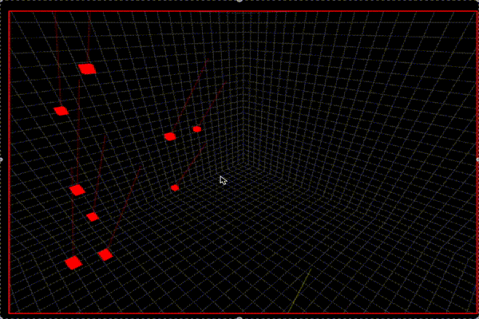

# Shield Drone

Shield Drone is one day project to test Three.js, React, and Python for a simple simulation environment. Inspired by Anduril's RoadRunner, I wondered how a controller would make targeting decisions, and how to generate "training data".  

There are very sophisticated SIM environments for training drones like Nvidia Isaac Gym, but a simple simulation environment for quickly prototyping seemed fun. 

## Questions

> How can I create a drone strategy environment that is easy to understand and modify?

First looked at [Colosseum]( https://github.com/CodexLabsLLC/Colosseum.git)(Airsim), [Parrot's Sphinx](https://developer.parrot.com/docs/sphinx/index.html), and Nvida's Isaac Gym   

Settled on Python on the backend since I'm more familiar with it.

> Can I use OpenAI realtime multi-modal as a control system? or Groq multi-modal open source llama3?

Didn't make it this far!

## Game

Attacking drones try to fly into some number of Assets. Defeinding drones protect the objects and intercept the first drone. 

In the current niave implemention, attacking drones have perfect information about the Assets, and the defending drones have perfect information about the attacking drones. Defending drones start from the ground and are 3x as fast as attacking drones. 

## Setup

Assumes you have `pyenv`  installed.

    pyenv install 3.11-dev
    pyenv virtualenv 3.11-dev shielddrone
    pyenv activate
    pip install -r requirements.txt

    cd frontend
    npm install 
    npm run dev

# features

defending drones have higher max speed but start at y=0. 
defending drones have complete situational awareness
defending drones arranged near projected objects, center
defending drones can collide with attacking drones and not be damaaged

## TODO 

- BUG: color doesn't change on collision with ground asset
- BUG: camera view isn't current location of object
- FEATURE: formations and strategies not implemented - should stay near assets or be aggressive or hybrid
- FEATURE: store game output in file for training NN
- FEATURE: path finding without perfect information - like radar range
- FEATURE: simple coordination system for defending and attacking drones 

## want to make a gif?

    ffmpeg -i ~/Desktop/spl/Screen\ Recording\ 2024-12-23\ at\ 8.31.31 PM.mov -s 600x400 -pix_fmt rgb24 -f gif - | gifsicle --optimize=3 > screencapture.gif